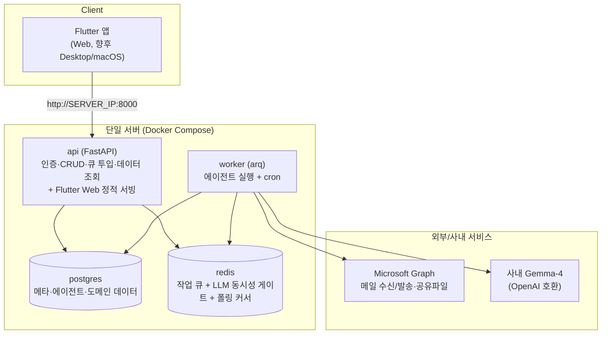
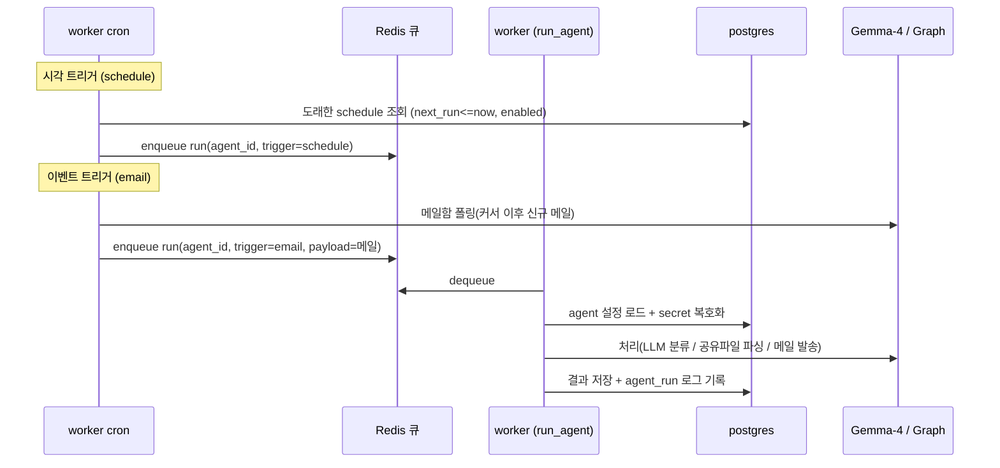
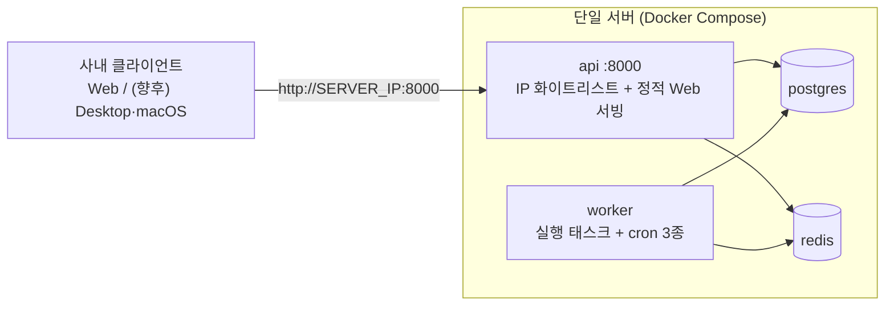

# 01. 아키텍처

## 설계 원칙

1. **템플릿 프레임워크가 1급 시민** — 개별 에이전트는 프레임워크 위의 플러그인. 새 템플릿 추가 비용을 최소화한다.
2. **트리거와 실행의 분리** — "언제 도는가"(이벤트/시각)와 "무엇을 하는가"(처리 로직)를 분리해 큐로 연결한다.
3. **백엔드/프론트엔드 완전 분리** — 프론트(Flutter)는 REST API만 소비. 서버 렌더링 없음.
4. **멀티테넌트 격리** — 모든 데이터·자격증명은 `user`/`agent` 단위로 스코프. 한 사용자의 에이전트가 다른 사용자 데이터에 접근 불가.
5. **사내 전용 보안 자세** — 도메인/리버스 프록시 없이 서버 IP:포트로 직접 접속. **백엔드 미들웨어의 IP 화이트리스트**(사내망 대역)로 접근 제어하고, 회사 이메일 로그인으로 세션을 발급한다.

---

## 구성요소

배포 단위는 **2개 애플리케이션 컨테이너(api, worker) + 2개 데이터 컨테이너(postgres, redis)**다.

### 컨테이너별 책임

| 컨테이너 | 책임 |
|---|---|
| **api** | IP 화이트리스트 미들웨어, 이메일 로그인/세션, 에이전트 CRUD, 설정 마법사 처리, 큐 잡 투입, 프론트에 도메인 데이터(칸반/로그) 제공, Flutter Web 정적 서빙 |
| **worker** | 큐 태스크(`run_agent`·`setup_agent`·`teardown_agent`) 실행 + 매분 cron 3종: **스케줄 디스패치**(도래한 스케줄→큐), **메일 폴링**(수신 메일→큐), **Graph 구독 갱신**(webhook 모드 시). LLM·Graph 호출의 실제 주체 |
| **postgres** | 영속 데이터 |
| **redis** | 작업 큐(arq), LLM 동시성 게이트, 메일 폴링 커서 |

> 부하가 늘면 worker를 수평 확장하거나 역할(스케줄러/폴링/실행)별로 컨테이너를 분리할 수 있다. 현재는 단일 worker가 모두 담당한다.

---

## 트리거 → 실행 파이프라인

두 종류의 트리거를 **하나의 실행 큐**로 수렴시킨다. worker는 큐에서 잡을 꺼내 해당 에이전트 템플릿의 처리 로직을 실행한다.

- **이벤트(수신 메일)**: worker의 폴링 cron이 대상 메일함에서 커서 이후 신규 메일을 찾아, 그 메일함을 구독하는 에이전트마다 `run`을 투입한다. (webhook 모드를 켜면 Graph 알림으로 즉시 투입.)
- **시각(스케줄)**: 디스패치 cron이 매분 `schedules`에서 도래분(`next_run_at<=now AND enabled`)을 찾아 `run`을 투입하고 `next_run_at`을 재계산한다.

---

## 기술 스택과 선택 근거

### 백엔드 — FastAPI + uv (Python 3.12)
- `uv`로 의존성·환경 관리(`pyproject.toml`). ORM은 **SQLAlchemy 2.0 async** + **Alembic**, 검증은 **Pydantic v2**.

### 큐 — Redis + arq
- **arq**는 asyncio 네이티브라 async FastAPI/워커와 결이 맞고 가볍다. cron 기능이 내장되어 스케줄 디스패치·폴링·구독 갱신을 같은 워커에서 처리한다.

### LLM — 사내 Gemma-4 (OpenAI 호환)
- `LLMClient` 인터페이스 뒤에 구현을 두어 교체 가능. 기본값은 사내 Gemma-4 — OpenAI 호환 엔드포인트 `http://<사내-LLM-호스트-endpoint>`, 모델 `google/gemma-4-26B-A4B-it`. 사내망이라 데이터가 외부로 나가지 않는다.
- 모든 LLM 호출은 **Redis 동시성 게이트**를 통과해 동시 호출 수를 제한한다(추론 서버 과부하 방지). 사용량/비용 적재용 `llm_jobs` 테이블을 두었고, 사용자별 쿼터·과금 연동은 확장 지점이다.

### 메일 I/O — Microsoft Graph
- 앱 전용(client credentials)으로 토큰을 발급해 메일 수신 조회·발송, 공유 파일 다운로드, (webhook 모드 시) 구독을 수행한다.
- 수신은 기본 **폴링**(워커 cron)으로 처리하며, 공개 HTTPS 콜백을 갖추면 **Graph 구독(webhook)**으로 전환할 수 있다(코드 내장).

### 인증 — 회사 이메일 로그인 + JWT 세션
- 회사 이메일(`@llsollu.com`)로 로그인하면 사용자가 생성/조회되고 **장기 세션 쿠키(JWT, httpOnly)**가 발급된다 → 재방문 시 자동 로그인.
- 인증 모듈은 교체 가능하도록 분리되어 있어, 필요 시 조직 SSO(OIDC)로 확장할 수 있다.

### 프론트엔드 — Flutter
- 단일 코드베이스로 **Web**(현재 빌드·서빙)과 향후 **Desktop/macOS**를 지원. 상태관리 **Riverpod**, HTTP **Dio**.
- API 베이스 URL은 빌드 시 주입(`--dart-define=API_BASE=`). Web은 API가 같은 오리진에서 서빙하므로 상대경로 `/api`를 쓴다.
- **모든 뷰 화면 우상단에 ⚙️ 설정 버튼** → 에이전트 생성 시 설정을 스키마 기반 폼으로 열람·수정 후 `PATCH /api/agents/{id}`로 저장.

### 배포 — Docker Compose (프록시 없음)
- 도메인을 쓰지 않으므로 프록시 없이 **api가 직접 `:8000`을 노출**하고, IP 화이트리스트는 FastAPI 미들웨어에서 처리한다.
- 관측성: 헬스체크(`/api/health`) + 구조화 로그. 이후 메트릭 대시보드 확장 여지.

---

## 배포 토폴로지

- 접속: `http://<서버IP>:8000` (Web은 API가 서빙, Desktop/macOS 앱은 이 주소를 API 베이스로 설정).
- 확장: worker 수평 확장 → 역할별 컨테이너 분리.
