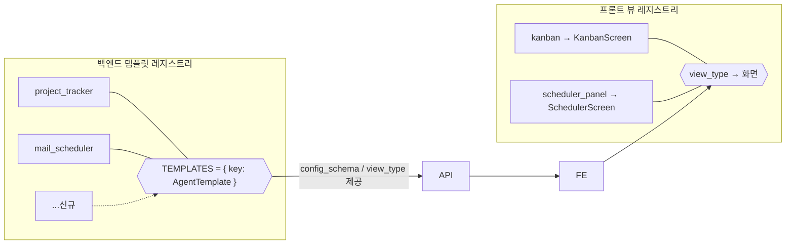
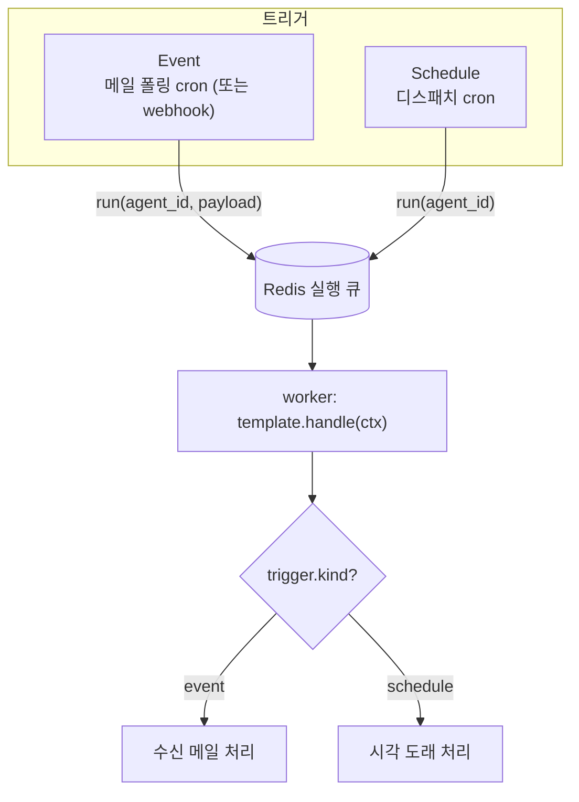
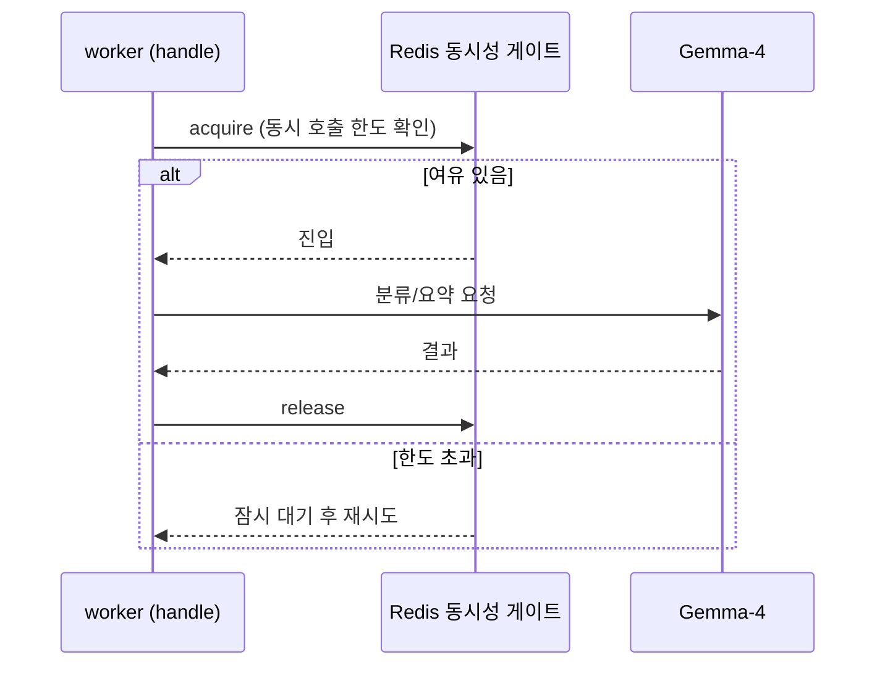

# 02. 에이전트 템플릿 프레임워크 (핵심)

플랫폼의 모든 에이전트는 하나의 공통 구조 — **"트리거 + 소스 + 처리 + 액션 + 뷰"** 5요소 — 로 표현된다. 새 템플릿은 이 5요소를 채우는 모듈 한 개로 추가된다.

## 5요소 추상화

**Agent = Trigger(언제) · Source(무엇을 읽고) · Processor(어떻게 처리) · Action(무엇을 하고) · View(어떻게 보여줄지)**

기본 제공 두 템플릿이 이 구조로 어떻게 표현되는지:

| 요소 | project_tracker | mail_scheduler |
|---|---|---|
| **Trigger** | 이벤트: 새 메일 수신 | 시각: cron 도래 |
| **Source** | 지정 메일함 | 공유 스프레드시트 + 발행일 규칙 |
| **Process** | LLM 분류·요약 → 고객사/프로젝트/이슈 도출 | 파일 파싱 → 오늘 대상 행 선별 → 본문 생성 |
| **Action** | 프로젝트/이슈 DB 갱신 | 메일 발송 / 필수값 누락 시 담당자 알림 |
| **View** | 칸반 보드(`kanban`) | 스케줄러 패널(`scheduler_panel`) |

---

## 템플릿 인터페이스

템플릿은 `AgentTemplate` 프로토콜을 구현한다(백엔드 `app/framework/base.py`).

```python
class TriggerSpec:
    kind: Literal["event", "schedule"]
    detail: dict            # event: 구독할 mailbox 설정 키 / schedule: 기본 cron 등

class ConfigField:          # 설정 마법사가 이 스키마로 폼을 그린다
    key: str
    label: str
    type: Literal["string","text","secret","email","url","select","cron","bool","int"]
    required: bool
    help: str | None
    options: list[str] | None
    default: object | None
    secret: bool            # True면 secrets_enc(암호화 컬럼)로 저장

class ViewSpec:
    view_type: str          # 프론트 뷰 레지스트리 키 (예: "kanban", "scheduler_panel")
    data_endpoints: list[str]

class AgentTemplate(Protocol):
    key: str                # "project_tracker", "mail_scheduler"
    name: str
    version: str
    description: str
    trigger: TriggerSpec
    view: ViewSpec

    def config_schema(self) -> list[ConfigField]: ...       # 설정 폼 정의
    async def on_setup(self, ctx: SetupContext) -> None: ...  # 프로비저닝(검증·구독 생성 등)
    async def handle(self, ctx: RunContext) -> RunResult: ... # 트리거마다 호출되는 실제 처리
    async def on_teardown(self, ctx: SetupContext) -> None: ...# 삭제/비활성화 시 정리
```

### RunContext (워커가 `handle()`에 주입)
- `ctx.config` — 사용자가 마법사에서 넣은 비민감 설정
- `ctx.secrets` — 복호화된 민감 설정
- `ctx.db` — DB 세션(도메인 쿼리는 `agent_id`로 스코프)
- `ctx.llm` — Redis 동시성 게이트를 경유하는 LLM 클라이언트
- `ctx.graph` — Microsoft Graph 클라이언트(메일 읽기/발송, 공유파일)
- `ctx.trigger_payload` — 이벤트 트리거 시 수신 메일 등 페이로드
- `ctx.dry_run` — 실제 발송 없이 시뮬레이션할지 여부
- `ctx.log(event, **data)` — `agent_run.stats`에 적재되는 구조화 로그(실행 로그의 원천)

---

## 레지스트리와 확장

백엔드는 `key → AgentTemplate` 레지스트리를, 프론트는 `view_type → 화면` 레지스트리를 둔다.



**새 템플릿 추가 절차:**
1. 백엔드에 `AgentTemplate` 구현 모듈 1개 작성 후 레지스트리에 등록(`register(...)`).
2. `config_schema()`만 정의하면 설정 마법사·⚙️ 설정 폼이 자동 생성된다(프론트는 스키마 기반 렌더링).
3. 새로운 시각화가 필요할 때만 `view_type`에 대응하는 프론트 화면 1개를 추가한다. 기존 뷰(`kanban`/`scheduler_panel`)를 재사용하면 프론트 수정이 필요 없다.

---

## 트리거 통합 모델

두 트리거 종류를 하나의 실행 큐로 수렴시키고, 워커가 소비한다.



- **Event**: 폴링 cron이 대상 메일함에서 커서 이후 신규 메일을 찾아, 그 메일함을 구독하는 에이전트마다 `run`을 투입. 콜드스타트 시 과거 메일 일괄 처리를 막기 위해 에이전트 활성화 시점을 커서로 초기화한다.
- **Schedule**: 디스패치 cron이 매분 도래한 스케줄을 찾아 `run`을 투입하고, 스케줄의 타임존 기준으로 다음 실행 시각을 재계산한다.

---

## LLM 호출 흐름

LLM 호출은 Redis 동시성 게이트를 통과해 동시 호출 수를 제한한다.



- 목적: 여러 사용자가 동시에 몰려도 사내 추론 서버 과부하를 막는다.
- `llm_jobs` 테이블에 모델·토큰·비용을 적재해 사용량 모니터링·쿼터의 근거로 삼을 수 있다(연동은 확장 지점).
