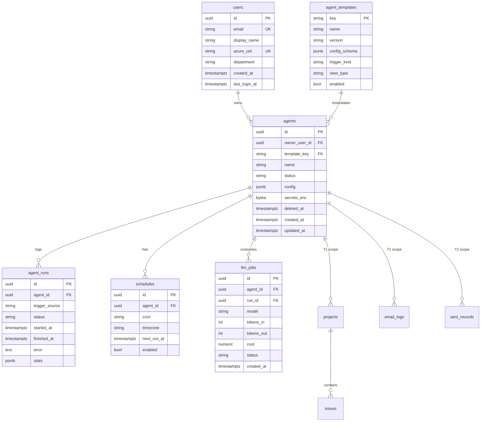

# 03. 데이터 모델

PostgreSQL 기준. 모든 도메인 데이터는 `agent_id`로 스코프되어 멀티테넌트 격리를 강제한다.

## ER 개요

## 테이블 설명

### 플랫폼 공통

- **users** — 회사 이메일 로그인 시 생성/조회. `email`이 로그인·표시 식별자, `azure_oid`·`department`는 조직 SSO 확장 시 채우기 위한 예비 컬럼.
- **agent_templates** — 코드 레지스트리(권위)를 DB에 미러링해 목록·버전·설정스키마를 프론트에 제공. `enabled`로 노출 제어.
- **agents** — 한 사용자의 구성된 에이전트 인스턴스. 핵심 컬럼:
  - `status`: `configuring | active | paused | error` (사용자 흐름의 "구성 중" 로딩과 on/off에 대응)
  - `config` (JSONB): 비민감 설정(참조 파일 URL, 규칙, 대상 mailbox 등)
  - `secrets_enc` (bytea): 민감 설정(토큰/키 등) **앱단 암호화(Fernet) 후 저장** — 평문 보관 금지
  - `deleted_at`: 소프트 삭제 표시(비어 있으면 활성)
- **agent_runs** — 모든 실행 이력. 스케줄러 패널의 "최근 실행 로그"는 이 테이블을 조회한다. `stats`에 처리 건수/발송 수/스킵 사유·구조화 로그(events) 등.
- **schedules** — 시각 트리거. 워커의 디스패치 cron이 `next_run_at`/`enabled` 기준으로 조회·재계산. on/off는 `enabled` 토글.
- **llm_jobs** — LLM 사용량/비용 적재용(모니터링·쿼터 근거).

### project_tracker 도메인

- **projects** (`agent_id`, client_name, title, status[active/on_hold/completed/cancelled], phase, priority, latest_update, last_activity_at)
- **issues** (`project_id`, type, summary, severity, status[open/in_progress/resolved], detected_at, resolved_at)
- **email_logs** (`agent_id`, message_id, subject, from_address, client_name, summary, action_required, received_at)

> 칸반에서 프로젝트를 완료(`completed`)/취소(`cancelled`)로 옮기면 그 프로젝트의 미해결 이슈를 자동으로 `resolved` 처리한다.

### mail_scheduler 도메인

- 설정 위주라 별도 대형 테이블은 최소. **sent_records**(`agent_id`, target, subject, status[sent/skipped/failed], detail, sent_at)에 발송/스킵/실패 이력을 적재하고, `detail`에 스킵 사유(누락 항목)나 오류 메시지를 담는다.

## 격리·인덱싱 원칙

- 모든 도메인 쿼리는 `agent_id`(및 소유자 `user_id`)로 스코프해 테넌트 간 접근을 차단한다. 필요 시 Postgres RLS로 강화.
- 인덱스: `agents(owner_user_id)`, `agent_runs(agent_id, started_at desc)`, `schedules(enabled, next_run_at)`, `issues(project_id, status)`.
- 삭제는 **소프트 삭제**(`deleted_at`)를 채택한다.
