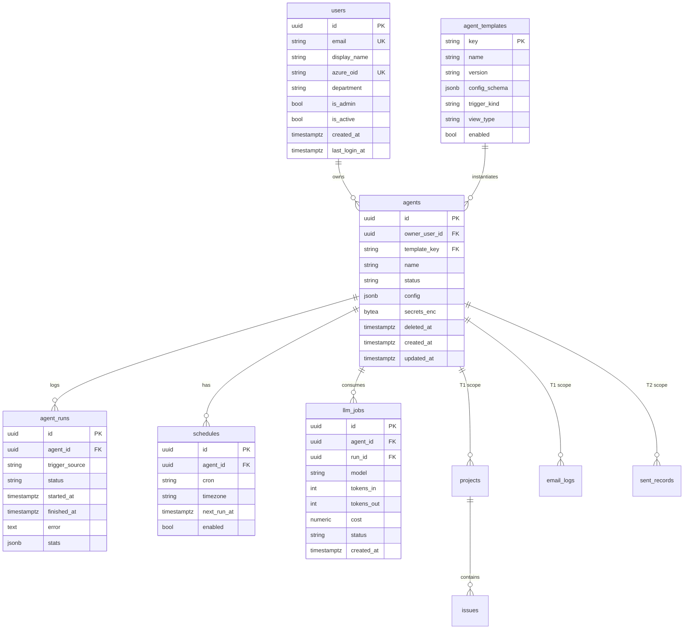

# 03. 데이터 모델

PostgreSQL 기준. 모든 도메인 데이터는 `agent_id`로 스코프되어 멀티테넌트 격리를 강제한다.

## ER 개요

```mermaid
erDiagram
    users ||--o{ agents : owns
    agent_templates ||--o{ agents : instantiates
    agents ||--o{ agent_runs : logs
    agents ||--o{ schedules : has
    agents ||--o{ llm_jobs : consumes
    agents ||--o{ projects : "T1 scope"
    projects ||--o{ issues : contains
    agents ||--o{ email_logs : "T1 scope"
    agents ||--o{ sent_records : "T2 scope"

    users {
        uuid id PK
        string email UK
        string display_name
        string azure_oid UK
        string department
        bool is_admin
        bool is_active
        timestamptz created_at
        timestamptz last_login_at
    }
    agent_templates {
        string key PK
        string name
        string version
        jsonb config_schema
        string trigger_kind
        string view_type
        bool enabled
    }
    agents {
        uuid id PK
        uuid owner_user_id FK
        string template_key FK
        string name
        string status
        jsonb config
        bytea secrets_enc
        timestamptz deleted_at
        timestamptz created_at
        timestamptz updated_at
    }
    agent_runs {
        uuid id PK
        uuid agent_id FK
        string trigger_source
        string status
        timestamptz started_at
        timestamptz finished_at
        text error
        jsonb stats
    }
    schedules {
        uuid id PK
        uuid agent_id FK
        string cron
        string timezone
        timestamptz next_run_at
        bool enabled
    }
    llm_jobs {
        uuid id PK
        uuid agent_id FK
        uuid run_id FK
        string model
        int tokens_in
        int tokens_out
        numeric cost
        string status
        timestamptz created_at
    }
```

## 테이블 설명

### 플랫폼 공통

- **users** — 회사 이메일 로그인 시 생성/조회. `email`이 로그인·표시 식별자, `azure_oid`·`department`는 조직 SSO 확장 시 채우기 위한 예비 컬럼. `is_admin`(관리자 페이지 접근·`ADMIN_EMAILS` env 부트스트랩 + UI 승격), `is_active`(false면 로그인 차단).
- **agent_templates** — *현재는 별도 DB 테이블이 아니라 **코드 레지스트리**(`framework/registry`)가 권위다.* 목록·버전·설정스키마는 `GET /templates`가 레지스트리에서 직접 제공한다.(아래 ER의 agent_templates 는 개념상 관계 표현일 뿐 실제 테이블 아님)
- **agents** — 한 사용자의 구성된 에이전트 인스턴스. 핵심 컬럼:
  - `status`: `configuring | active | paused | error` (사용자 흐름의 "구성 중" 로딩과 on/off에 대응)
  - `config` (JSONB): 비민감 설정(참조 파일 URL, 규칙, 대상 mailbox 등)
  - `secrets_enc` (bytea): 민감 설정(토큰/키 등) **앱단 암호화(Fernet) 후 저장** — 평문 보관 금지
  - `deleted_at`: 소프트 삭제 표시(비어 있으면 활성)
- **agent_runs** — 모든 실행 이력. 스케줄러 패널의 "최근 실행 로그"는 이 테이블을 조회한다. `stats`에 처리 건수/발송 수/스킵 사유·구조화 로그(events) 등.
- **schedules** — 시각 트리거. 워커의 디스패치 cron이 `next_run_at`/`enabled` 기준으로 조회·재계산. on/off는 `enabled` 토글.
- **llm_jobs** — LLM 사용량/비용 적재용(모니터링·쿼터 근거).

### 공유 메일 분석(수신형 공통)

- **mail_records** (모델 `MailRecord`) — **메일함 단위 공유 저장소**. `(mailbox, message_id)` 유일. 이슈 보드·타임라인이 동일 메일을 **중복 분석하지 않도록** 분석을 1회만 수행·캐시한다. 상세 [08](08-shared-analysis-and-timeline.md).
  - 원문: subject, from_address/from_name, **to_recipients/cc_recipients(전체 내역)**, received_at, body_text(인용 제거 후 현재 내용만)
  - 공유 분석: client_name, project_title, category, summary, action_required, issue, points, **keywords(핵심+유사어)**, **recipient_role(to=직접수신/cc=참조/other)**, analyzed, analyzer_version

### project_tracker 도메인(이슈 보드)

- **projects** = **메일 1건당 카드 1개**(`source_message_id`로 원본 `mail_records` 링크, 이 기준으로 멱등 업서트). 컬럼: `agent_id`, client_name, title, `status[storyboard/active/on_hold/completed/cancelled]`(신규 카드 기본 **storyboard**), category, priority, latest_update, keywords, from_name/from_address, recipient_role, last_activity_at, `archived_at`(완료 후 N일 경과 시 자동 아카이브 → 보드에서 제외)
- **issues** (`project_id`, type, summary, severity, status[open/in_progress/resolved], detected_at, resolved_at) — 카드의 해당 메일 이슈 1건
- **email_logs** — *레거시(현재 미사용).* 수신 분석은 위 `mail_records`로 대체됨

> 칸반에서 프로젝트를 완료(`completed`)/취소(`cancelled`)로 옮기면 그 프로젝트의 미해결 이슈를 자동으로 `resolved` 처리한다. (칸반 UI 컬럼은 storyboard·active·on_hold·completed 4단; cancelled 상태값은 유지되나 컬럼 노출은 제거)

### mail_scheduler 도메인

- 설정 위주라 별도 대형 테이블은 최소. **sent_records**(`agent_id`, target, subject, status[sent/skipped/failed], detail, sent_at)에 발송/스킵/실패 이력을 적재하고, `detail`에 스킵 사유(누락 항목)나 오류 메시지를 담는다. 발송 실패·파일 소실·필요 데이터 필드 소실 시 `alert_email`(기본 발신자 본인)로 오류 알림 메일을 보낸다.

## 격리·인덱싱 원칙

- 모든 도메인 쿼리는 `agent_id`(및 소유자 `user_id`)로 스코프해 테넌트 간 접근을 차단한다. 필요 시 Postgres RLS로 강화.
- 인덱스: `agents(owner_user_id)`, `agent_runs(agent_id, started_at desc)`, `schedules(enabled, next_run_at)`, `issues(project_id)`, `mail_records(mailbox, received_at desc)`·unique`(mailbox, message_id)`, `projects(agent_id, status, updated_at)`·`projects(agent_id, archived_at)`.
- 삭제는 **소프트 삭제**(`deleted_at`)를 채택한다(에이전트). 실행 이력(`agent_runs`)은 보존기간 경과분 정리, 완료 카드는 아카이브로 누적을 억제한다.
