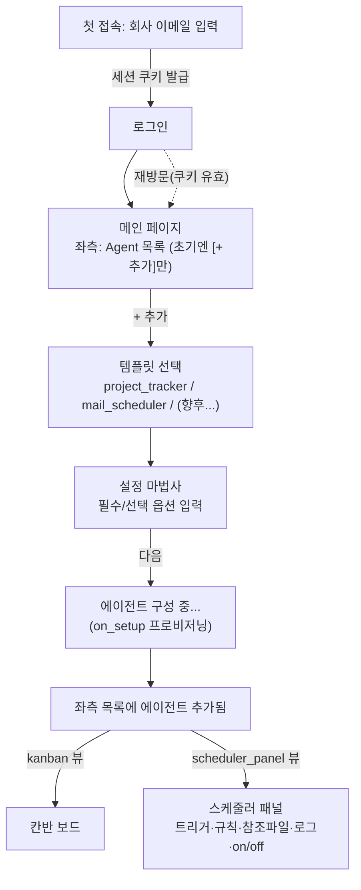
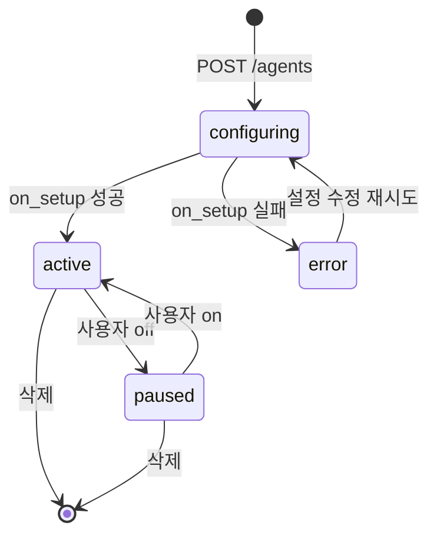

# 04. 사용자 흐름

## 화면 흐름

모든 API 경로는 `/api` 하위다.

## 단계별 동작 + API

### 1. 로그인 ("이메일 입력 → 이후 자동 로그인")
- 최초: 회사 이메일(`@llsollu.com`) 입력 → 사용자 생성/조회 → **장기 세션 쿠키(JWT, httpOnly)** 발급.
- 재방문: 앱이 `GET /api/me`로 세션을 확인 → 유효하면 자동 로그인, 아니면 로그인 화면.
- API: `POST /api/auth/login {email}` · `GET /api/me` · `POST /api/auth/logout`

### 2. 메인 / 에이전트 목록
- 좌측 사이드바 = 내 에이전트 목록. 초기엔 비어 있고 `+ 추가`만.
- API: `GET /api/agents` (소유자=현재 사용자로 스코프)

### 3. 템플릿 선택
- 사용 가능한 템플릿(enabled) 카드 목록.
- API: `GET /api/templates` → `[{key, name, description, view_type, trigger_kind}]`

### 4. 설정 마법사
- 선택 템플릿의 `config_schema`로 폼 렌더(필수/선택 구분, 타입별 위젯). secret 필드는 마스킹.
- 예) mail_scheduler: 참조 파일 URL(필수), 발송 계정(필수), 수신자(필수), 알림 이메일(선택), 스케줄 cron(선택)
- 예) project_tracker: 대상 메일함(필수), 고객사 힌트(선택)
- API: `GET /api/templates/{key}/config-schema`

### 5. "다음" → 구성 중 로딩
- `POST /api/agents` (template_key + config + secrets) → `status=configuring` 생성 → 워커가 `on_setup()` 비동기 프로비저닝(설정 검증, 스케줄/구독 준비).
- 프론트는 상태를 폴링해 로딩 표시.
- 성공 시 `status=active`, 실패 시 `error`(사유 표시).
- API: `POST /api/agents` → `GET /api/agents/{id}` (status 폴링)

### 6-a. kanban 뷰 → 칸반 보드
- `view_type="kanban"`. 프로젝트/이슈를 상태 컬럼별로.
- API: `GET /api/agents/{id}/projects`, `PATCH /api/agents/{id}/projects/{pid}/status` (컬럼 이동)

### 6-b. scheduler_panel 뷰 → 스케줄러 패널
- `view_type="scheduler_panel"`. 트리거·규칙·참조 파일 URL·최근 실행 로그·**on/off 토글**.
- API: `GET /api/agents/{id}` (설정), `GET /api/agents/{id}/runs?limit=50` (로그), `GET/PATCH /api/agents/{id}/schedule {enabled}` (on/off), `POST /api/agents/{id}/run?dry_run=` (수동 실행/드라이런)

### 7. ⚙️ 설정 (모든 뷰 공통)
- **모든 뷰 화면 우상단에 기어 버튼**. 클릭 시 생성 때 입력한 설정을 스키마 기반 폼으로 열람.
- 수정 후 저장 → `PATCH /api/agents/{id}` (config/secrets 갱신). secret은 미입력 시 기존값 유지. 저장 시 재프로비저닝된다.
- 이름 변경·삭제도 이 화면에서.
- API: `GET /api/agents/{id}`, `PATCH /api/agents/{id}`, `DELETE /api/agents/{id}`

## 상태 머신 (agent.status)

