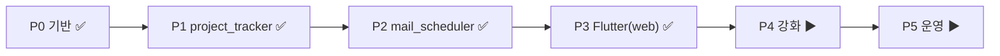

# 05. 구현 로드맵과 현재 상태

각 단계는 데모 가능한 산출물을 남긴다. ✅ = 구현·검증 완료, ▶ = 진행/예정.

## ✅ Phase 0 — 기반
- 저장소 구조(backend/, frontend/, deploy/), `uv` 프로젝트, Docker Compose(postgres·redis·api·worker)
- DB 스키마(SQLAlchemy) + 부트스트랩 도구
- **에이전트 프레임워크**([02](02-agent-framework.md)): `AgentTemplate` 인터페이스, 레지스트리, RunContext, arq 큐 + 워커
- 회사 이메일 로그인 + `/me` + IP 화이트리스트 미들웨어

## ✅ Phase 1 — project_tracker 템플릿
- 대상 메일함 폴링 → LLM 분류·요약 → projects/issues 갱신
- 칸반 데이터 API + 완료/취소 시 이슈 자동 resolved 처리
- 콜드스타트 시 과거 메일 일괄 처리 방지(활성화 시점 커서 초기화)

## ✅ Phase 2 — mail_scheduler 템플릿
- 공유 스프레드시트(Graph) 파싱 → 발행일 규칙 매칭 → 본문 생성 → Graph 발송 / 필수값 누락 시 담당자 알림
- 워커의 매분 디스패치 cron + `schedules` 재계산(Asia/Seoul 기준)
- 수동 실행·드라이런 지원

## ✅ Phase 3 — 프론트엔드 (Flutter)
- 로그인, 에이전트 목록/추가 마법사(스키마 기반 폼), "구성 중" 로딩
- 뷰: `kanban`, `scheduler_panel`, 모든 뷰 공통 ⚙️ 설정 다이얼로그
- **Web 빌드·서빙 완료** (Desktop/macOS는 각 OS 빌드 남음)

## ▶ Phase 4 — 강화
- LLM 사용량 적재(`llm_jobs`)·사용자별 쿼터, 재시도·실패 알림
- 메일 수신을 폴링 → Graph 구독(webhook)으로 전환(공개 HTTPS 콜백 확보 시; 코드 내장)
- 헬스체크·구조화 로그 기반 관측성 확대

## ▶ Phase 5 — 운영·확장
- 백업/복구, 데이터 격리 재검증, 부하 증가 시 worker 분리
- 신규 템플릿 추가

## 현황 요약

> P0~P3은 서버에 배포되어 동작 확인됨(로그인 → 에이전트 생성 → 실행 → 뷰). 남은 것은 Desktop/macOS 빌드와 Phase 4 강화 항목.
