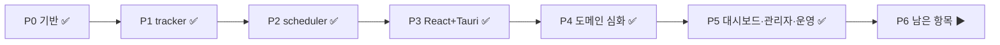

# 05. 구현 로드맵과 현재 상태

각 단계는 데모 가능한 산출물을 남긴다. ✅ = 구현·검증 완료, ▶ = 진행/예정.

## ✅ Phase 0 — 기반
- 저장소 구조(backend/, frontend-react/, deploy/), `uv` 프로젝트, Docker Compose(postgres·redis·api·worker)
- DB 스키마(SQLAlchemy) + 부트스트랩 도구
- **에이전트 프레임워크**([02](02-agent-framework.md)): `AgentTemplate` 인터페이스, 레지스트리, RunContext, arq 큐 + 워커
- 회사 이메일 로그인 + `/me` + IP 화이트리스트 미들웨어

## ✅ Phase 1 — project_tracker 템플릿
- 대상 메일함 폴링 → LLM 분류·요약 → projects/issues 갱신
- 칸반 데이터 API + 완료/취소 시 이슈 자동 resolved 처리
- 콜드스타트 시 과거 메일 일괄 처리 방지(활성화 시점 커서 초기화)

## ✅ Phase 2 — mail_scheduler 템플릿
- 공유 스프레드시트(Graph) 파싱 → 발행일 규칙 매칭 → 본문 생성 → Graph 발송 / 필수값 누락 시 담당자 알림
- 워커의 매분 디스패치 cron + `schedules` 재계산(Asia/Seoul 기준)
- 수동 실행·드라이런 지원

## ✅ Phase 3 — 프론트엔드 (React + Tauri)
- **Flutter → React(Vite+TS)+Tauri 전환 완료**(구 `frontend/` 삭제, [07](07-react-tauri-migration.md))
- 로그인, 에이전트 목록/추가 마법사(스키마 기반 폼), "구성 중" 로딩
- 뷰: 이슈 보드(kanban)·타임라인·`scheduler_panel`, 공통 ⚙️ 설정 다이얼로그
- Web 빌드·동일 오리진 서빙 완료 (데스크톱은 Windows/CI 빌드)

## ✅ Phase 4 — 도메인 심화
- **공유 메일 분석 + 타임라인**([08](08-shared-analysis-and-timeline.md)): 메일함 단위 1회 분석·캐시, 이슈 보드+타임라인 2뷰
- 분석 강화: 회사(llsollu) 컨텍스트, 수신/참조자 반영, **검색용 키워드·유사어**, **수신 역할(직접수신/참조)**
- 이슈 분류 **분야별 추천 커스터마이즈**, **메일 1건 = 카드 1개**(source_message_id 멱등)
- 원문 모달 HTML 정리·수신/참조 전체 표시, "최신 메일 분석"을 최근 N건 일괄 처리로

## ✅ Phase 5 — 대시보드·관리자·장기 운용
- **홈 통계 대시보드**(에이전트 구성별 섹션 조립, 서버 집계+시간창, 인라인 SVG, 60초 자동 갱신)
- **관리자 페이지**(사용자·에이전트 현황·LLM 사용량·운영 상태·데이터 용량) + 권한 모델(is_admin/is_active)
- **LLM 사용량 적재**(`llm_jobs`), 자동 발송 **오류 알림 메일**(run-level 포함)
- 장기 운용 최적화: projects N+1 제거·반환 상한·인덱스, 칸반 증분 렌더, `agent_runs` 정리 cron, 완료 카드 아카이브 cron, 타임라인 커서 페이지네이션

## ▶ Phase 6 — 남은 항목
- 메일 수신을 폴링 → Graph 구독(webhook)으로 전환(공개 HTTPS 콜백 확보 시; 코드 내장)
- 사용자별 LLM 쿼터, 실시간 갱신(Redis pub/sub→SSE), 데스크톱(Tauri) 정식 빌드
- 백업/복구, 부하 증가 시 worker 분리, 신규 템플릿 추가

## 현황 요약

```mermaid
flowchart LR
    P0["P0 기반 ✅"] --> P1["P1 tracker ✅"] --> P2["P2 scheduler ✅"] --> P3["P3 React+Tauri ✅"] --> P4["P4 도메인 심화 ✅"] --> P5["P5 대시보드·관리자·운영 ✅"] --> P6["P6 남은 항목 ▶"]
```

> P0~P5는 서버에 배포되어 실제 운영 중. 남은 것은 Phase 6(webhook 전환·쿼터·실시간·데스크톱 빌드 등).
